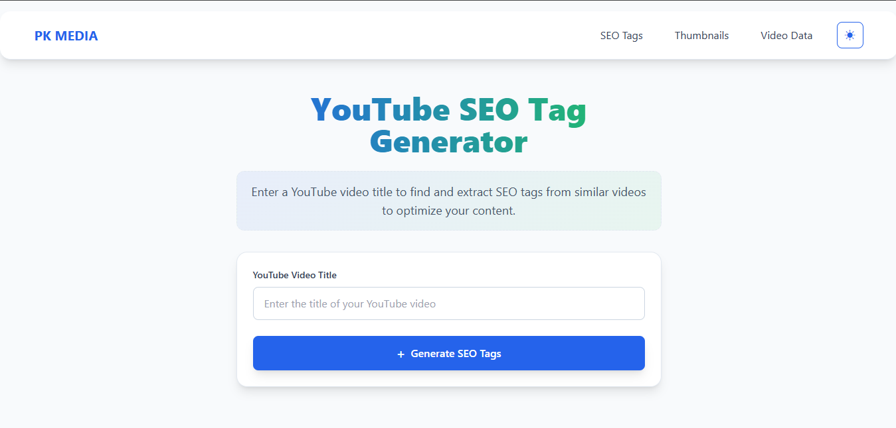

# 🎥 YouTube SEO Generator


---

Generate SEO-friendly content from YouTube videos with ease!  
This project helps creators and marketers boost their video performance by providing:

✅ **Hashtag Generator** – Extract relevant hashtags from any YouTube video.  
✅ **Thumbnail Downloader** – Instantly fetch the video thumbnail in high quality.  
✅ **Video Downloader** – Download YouTube videos directly.

---

## ⚡ Features
- Enter a YouTube video link to extract hashtags automatically.
- Download video thumbnails in one click.
- Save YouTube videos for offline use.
- Simple and user-friendly interface.

---

## 🛠️ Tech Stack
- **Java**
- **Spring Boot**
- **Spring WebFlux (HTTP Client)**
- **HTML, JavaScript, Tailwind CSS**

---

## 📸 Screenshots
Add screenshots of your project here 👇




---

## 🚀 Getting Started
1. Clone the repository
   ```bash
   git clone https://github.com/your-username/youtube-seo-generator.git
